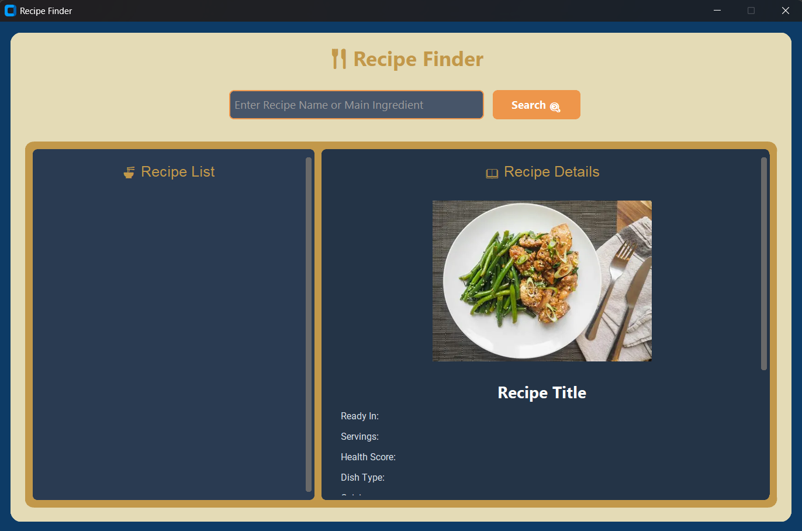
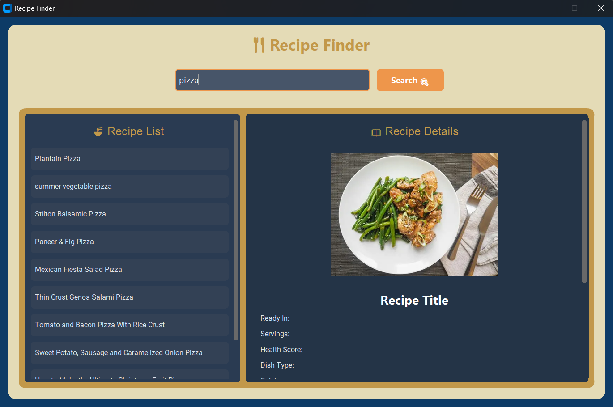
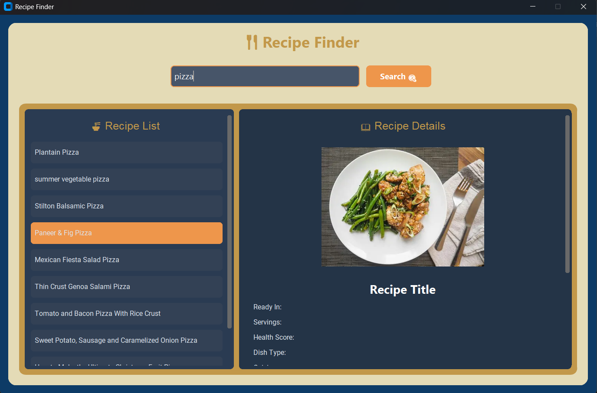
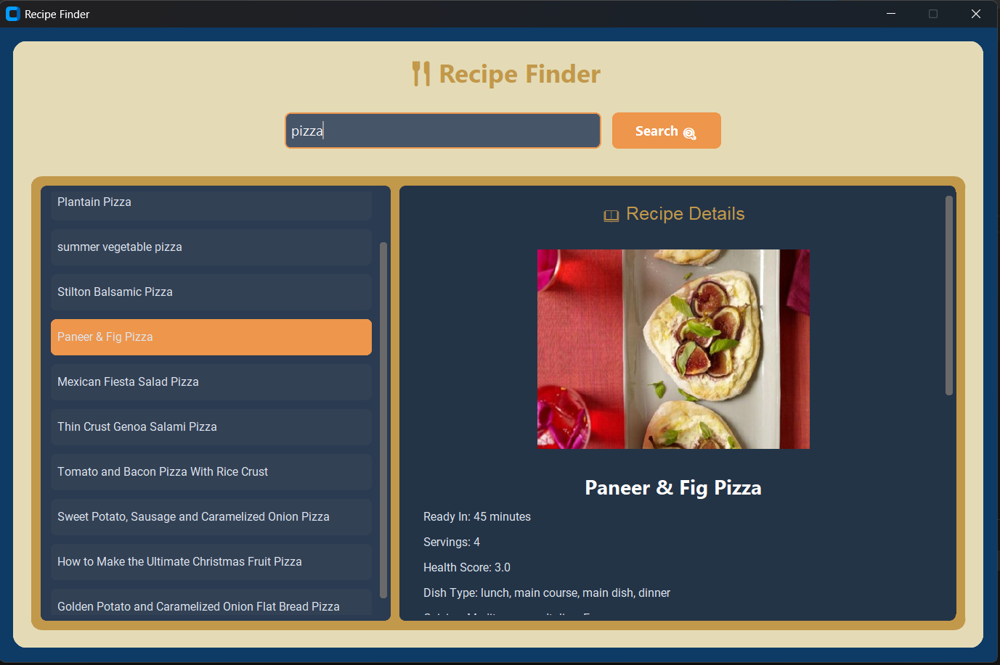
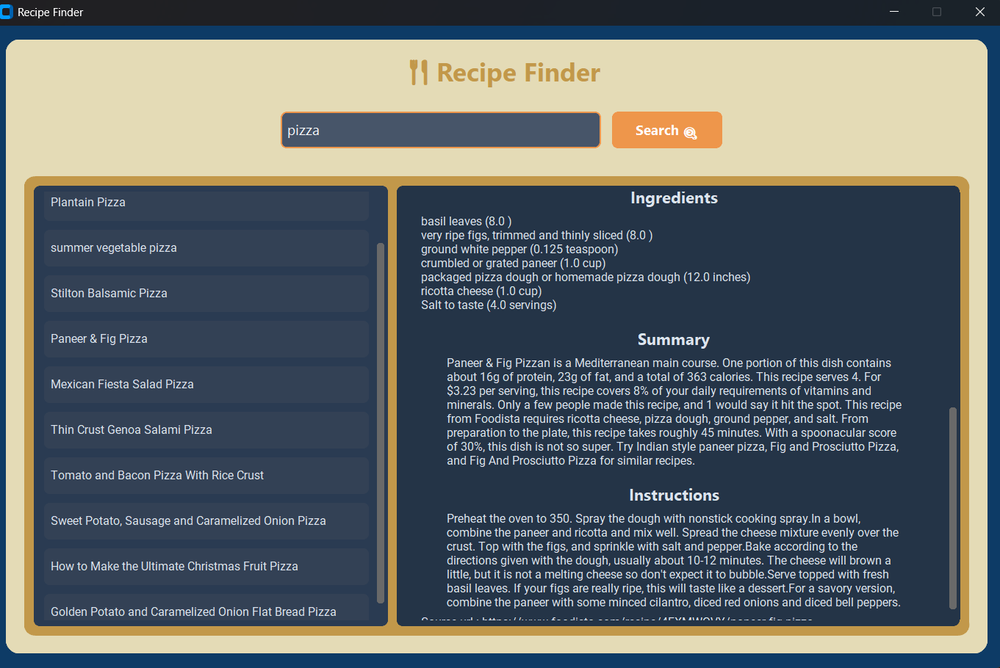

# 🍴 Recipe Finder

A modern desktop Recipe Finder application built with **Python**, **CustomTkinter**, and the **Spoonacular API**. Users can search recipes by name or ingredient, browse matching recipes, and view detailed cooking information along with images in an attractive graphical interface.

---

## ✨ Features

- 🔍 Search recipes by recipe name or main ingredient
- 📋 View a list of matching recipes
- 🖱️ Select any recipe to view complete details
- 🖼️ Display recipe image
- 🥗 View complete ingredient list
- 📝 Read recipe description
- 👨‍🍳 Step-by-step cooking instructions
- 🍽️ Display servings and cooking time
- ❤️ Health score information
- 🌍 Cuisine and dish type
- 🌱 Dietary information
  - Vegetarian
  - Vegan
  - Gluten Free
  - Dairy Free
- 🎨 Modern GUI built using CustomTkinter

---

## 📸 Screenshots

### Home Screen


### Search


### Recipes


### Recipe Details


### Recipe Instructions


---

## 🛠️ Tech Stack

- Python 3
- CustomTkinter
- Requests
- Pillow (PIL)
- python-dotenv
- Spoonacular API

---

## 📁 Project Structure

```
Recipe-Finder/
├── assets/
│   ├── home.png
│   ├── search.png
│   ├── recipes.png
│   ├── details.png
│   ├── instructions.png
│   └── placeholder.png
├── .env                    # Stores Spoonacular API key (not committed)
├── .gitignore
├── first.py                 # API calls — fetches recipe search results (id + title) and full recipe details
├── gui.py                    # Main application entry point (CustomTkinter GUI)
└── README.md
```

---

## ⚙️ Installation

### 1. Clone the repository

```bash
git clone https://github.com/Alishba964/Recipe-Finder.git
```

### 2. Navigate to the project folder

```bash
cd Recipe-Finder
```

### 3. Install the required libraries

```bash
pip install customtkinter requests Pillow python-dotenv
```

### 4. Create a `.env` file

```env
API_KEY=YOUR_SPOONACULAR_API_KEY
```

### 5. Run the application

```bash
python gui.py
```

---

## 🔑 Getting an API Key

1. Create an account on [Spoonacular](https://spoonacular.com/food-api).
2. Generate your free API key.
3. Create a `.env` file in the project folder.
4. Add your API key:

```env
API_KEY=YOUR_API_KEY
```

---

## 🚀 Usage

1. Launch the app with `python gui.py`
2. Type a recipe name or ingredient into the search bar and hit search
3. Browse the list of matching recipes returned
4. Click on any recipe to view its full details — ingredients, instructions, servings, cook time, health score, and dietary info

---

## 🔮 Future Improvements

- ⭐ Save favorite recipes locally for quick access
- 🔎 Advanced filtering (diet type, cuisine, max cooking time, calories)
- 🕘 Search history
- 🌗 Light/Dark theme toggle
- 📤 Export recipe details as PDF or text file
- 📶 Offline caching of previously viewed recipes
- 🧮 Ingredient unit converter (metric/imperial)
- 🗂️ Categorized browsing (breakfast, lunch, dinner, desserts)

---

## 👩‍💻 Contributors

- **Alishba Khan**
- **Kanxul Eman** — [github.com/eman9099](https://github.com/eman9099)
- **Zunairah Fatima** — [github.com/ZunairahFatima](https://github.com/ZunairahFatima)
